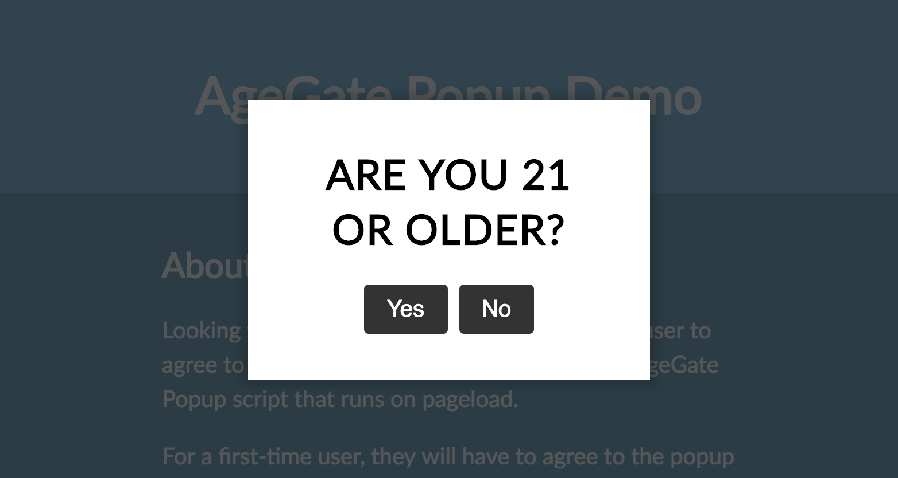

# AgeGate Popup
An extensible JavaScript plugin for site-builders like Squarespace to easily create an age-gate for free.

[](https://codepen.io/nicknish/full/prLbYV)

## Usage
For Squarespace or other site-builder usage, see [below](#Squarespace).

1. Add [script](dist/popup.min.js) to your website JavaScript.
2. On page ready, call `new Agegate`, passing in your options:

```javascript
new Agegate({
    cancelUrl: 'https://nicknish.co'
})
```

### Squarespace
1. Go to Settings.
2. Under the Website category, find Advanced.
3. Go to Code Injection. This is where you can add custom scripts to your Squarespace website.
4. Scroll to Footer.
5. [Click this link](dist/popup.min.js), copy the contents of the script, then paste it between two `<script>` HTML tags. 

```html
<script>
  // POPUP.MIN.JS SCRIPT GOES HERE
</script>
```

6. Then, before the `</script>` tag, right after the code you copied, add this:
```html
<script>
// POPUP.MIN.JS SCRIPT GOES HERE

(function(window) {
  function ready(fn) {
    if (document.attachEvent ? document.readyState === "complete" : document.readyState !== "loading"){
      fn();
    } else {
      document.addEventListener('DOMContentLoaded', fn);
    }
  }
  
  ready(function() {
    new Agegate({
      cancelUrl: 'https://nicknish.co' // This is where your user will be taken if they do not agree to the popup
    });
  })
}(window));
</script>
```

## To Do
1. ~~Create tutorial to add this to your Squarespace or site-builder website.~~
2. Add note about adding CSS from `popup.css`.
3. Update demo to be able to reset the popup cookie.
4. Add notes about dependencies, file size, and supported browsers.
5. Add Webpack to handle a lot of the heavy-loading and maintenance of this repo.

## Bugs?
Create a [new issue](https://github.com/nicknish/agegate-popup/issues/new) here.
